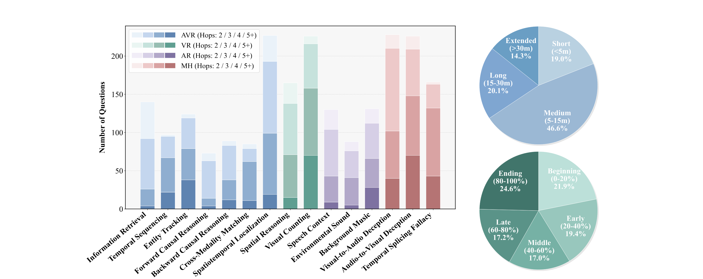
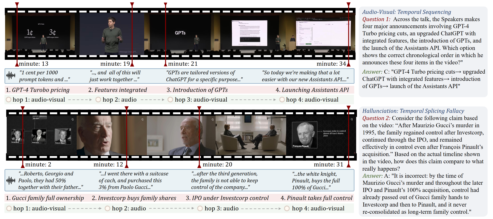
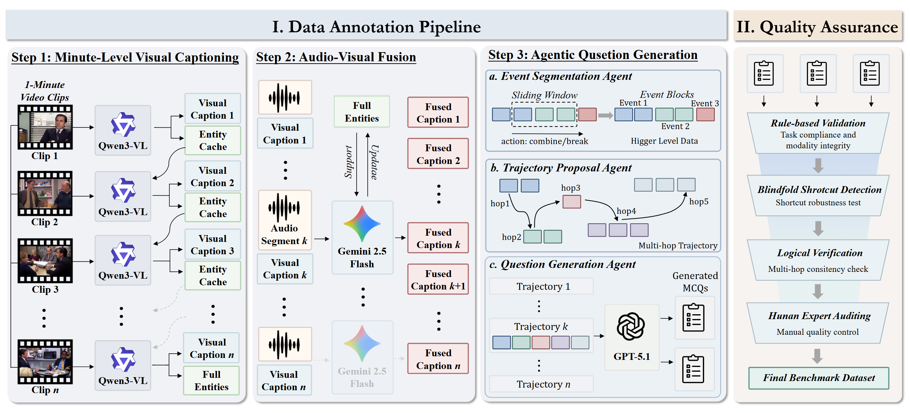

# TraceAV-Bench

Official repository for **TraceAV-Bench: Benchmarking Multi-Hop Trajectory Reasoning over Long Audio-Visual Videos**.

TraceAV-Bench evaluates omni-modal LLMs on multi-hop reasoning over long
audio-visual trajectories and on multimodal hallucination robustness. It
contains 2,200 trajectory-grounded multiple-choice questions over 578 long
videos, organized into 4 evaluation dimensions and 15 sub-tasks.

<p align="center">
  
</p>

## Repository Layout

```
TraceAV-Bench/
├── data/             # Benchmark JSON files and video mapping
├── src/              # Construction pipeline
├── intermediate/     # Per-stage intermediate artifacts
├── eval/             # Per-model evaluators and launchers
├── asset/            
└── requirements.txt
```

## Sub-Tasks

The 15 sub-tasks span four dimensions, encoded as a prefix in every `task_type`
and every filename under `data/`: `a_*` (AR), `v_*` (VR), `av_*` (AVR), `mh_*` (MH).

| Dim | Task file (= `task_type`)             | Sub-task (abbrev.)                | Videos | Questions |
|-----|---------------------------------------|-----------------------------------|-------:|----------:|
| AR  | `a_background_music.json`             | Background Music (BM)             |  120 |  131 |
| AR  | `a_environmental_sound.json`          | Environmental Sound (ES)          |   88 |   88 |
| AR  | `a_speech_context.json`               | Speech Context (SC)               |  121 |  130 |
| VR  | `v_spatial_reasoning.json`            | Spatial Reasoning (SR)            |  165 |  165 |
| VR  | `v_visual_counting.json`              | Visual Counting (VC)              |  219 |  226 |
| AVR | `av_information_retrieval.json`       | Information Retrieval (IR)        |  140 |  140 |
| AVR | `av_temporal_sequencing.json`         | Temporal Sequencing (TS)          |   95 |   97 |
| AVR | `av_entity_tracking.json`             | Entity Tracking (ET)              |  116 |  124 |
| AVR | `av_forward_causal_reasoning.json`    | Forward Causal Reasoning (FCR)    |   73 |   73 |
| AVR | `av_backward_causal_reasoning.json`   | Backward Causal Reasoning (BCR)   |   84 |   89 |
| AVR | `av_cross_modality_matching.json`     | Cross-Modality Matching (CMM)     |   84 |   85 |
| AVR | `av_spatiotemporal_localization.json` | Spatiotemporal Localization (SL)  |  225 |  227 |
| MH  | `mh_visual_to_audio_deception.json`   | Visual-to-Audio Deception (V2A)   |  218 |  230 |
| MH  | `mh_audio_to_visual_deception.json`   | Audio-to-Visual Deception (A2V)   |  220 |  229 |
| MH  | `mh_temporal_splicing_fallacy.json`   | Temporal Splicing Fallacy (TSF)   |  151 |  166 |

## Example

Every question is grounded in an explicit multi-hop evidence trajectory whose
hops are tagged with their source modality.

<p align="center">
  
</p>

## Data Format

Each task file in `data/` is a single JSON of the following shape:

```jsonc
{
  "task_type": "v_visual_counting",
  "video_count": 219,
  "question_count": 226,
  "items": [
    {
      "question_id": 1,
      "video_id": "video2",
      "question": "...",
      "options": {"A": "...", "B": "...", "C": "...", "D": "..."},
      "question_type": "single",          // "single" | "multiple"
      "correct_options": ["C"],
      "answer_text": "...",
      "minute_hop_count": 40,             // temporal span in minutes
      "hop_length_label": "long",         // "short" | "medium" | "long"
      "trajectory_with_timestamps": [
        {
          "event_id": 6,
          "evidence": "...",
          "label": "visual",              // "visual" | "audio" | "audio-visual"
          "reason": "...",
          "timestamp_minute": 42,
          "event_time_range": {"start_minute": 41, "end_minute": 44}
        }
      ],
      "difficulty": "medium"              // "easy" | "medium" | "hard"
    }
  ]
}
```

## Source Videos

Video files are not hosted in this repository. Every `video_id` referenced in
`data/*.json` is resolved through
[`data/video_name_mapping.json`](data/video_name_mapping.json):

- `source = "omnivideobench"` — download from the official
  [OmniVideoBench](https://github.com/NJU-LINK/OmniVideoBench) release; `id`
  matches their internal filename.
- otherwise — `id` is a YouTube video id; fetch from
  `https://www.youtube.com/watch?v=<id>`.

Save every file as `<video_id>.mp4` in a single flat directory
(e.g. `~/traceav_videos/`). All evaluators locate videos by this layout through
a `*_VIDEOS_DIR` environment variable defined in their launcher.

## Benchmark construction pipeline

<p align="center">
  
</p>

| Stage | Folder                                     |
|-------|--------------------------------------------|
| 1. Visual captioning     | `src/step1_visual_captioning/`              |
| 2. Audio-visual fusion   | `src/step2_audio_visual_fusion/`            |
| 3. Agentic QA generation | `src/step3_agentic_question_generation/`    |
| 4. Quality assurance     | `src/step4_quality_assurance/`              |

Per-stage intermediate outputs
are provided under `intermediate/` for inspection.

## Evaluation

Every evaluator lives in `eval/<model>/` with a matching `.sh` launcher and
reads its configuration from environment variables.

```bash
# Closed-source API (Gemini)
export BENCHMARK_DIR=$(pwd)/data
export GEMINI_API_KEY=<your_key>
bash eval/gemini/eval_gemini.sh

# Local HuggingFace checkpoint (Qwen3-VL)
export QWEN3VL_MODEL_PATH=/path/to/Qwen3-VL-32B-Instruct
export QWEN3VL_CLEANED_DIR=$(pwd)/data
export QWEN3VL_VIDEOS_DIR=/path/to/videos
bash eval/qwen3_vl/eval_qwen3_vl.sh

# OpenAI-compatible server (e.g. vLLM-hosted Qwen3-Omni)
export BENCHMARK_DIR=$(pwd)/data
export LVBENCH_BASE_URL=http://127.0.0.1:8000
bash eval/qwen3_omni/eval_qwen3_omni.sh
```

See [`eval/README.md`](eval/README.md) for the full list of supported models
and their environment variables.
